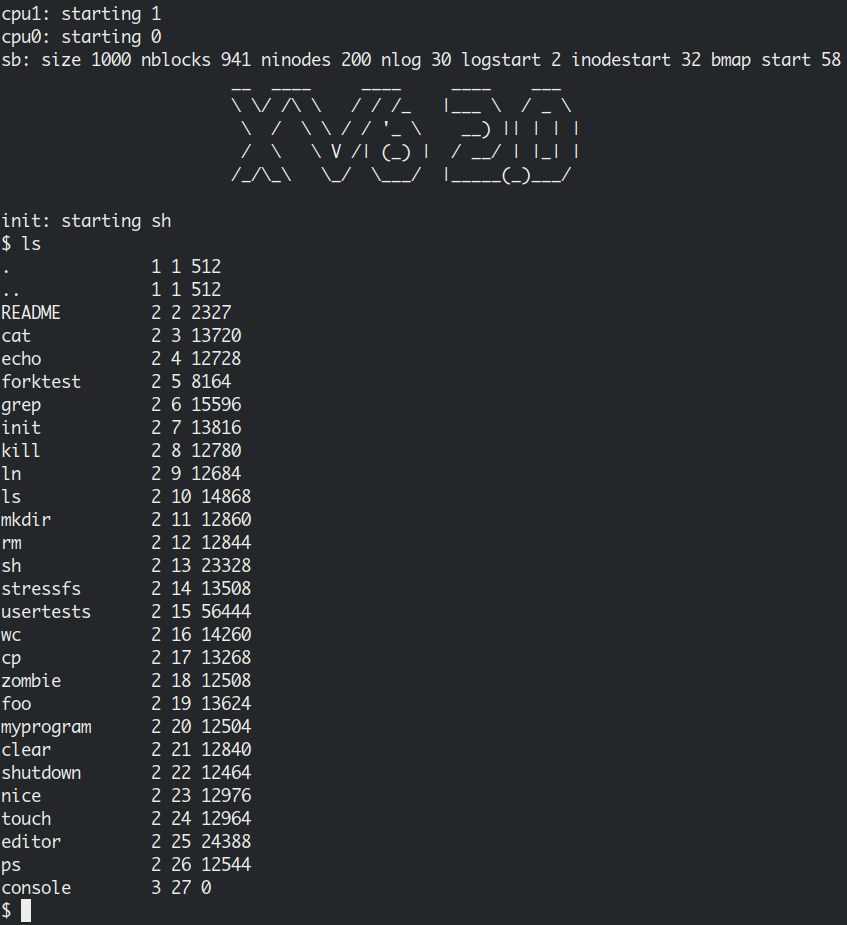

# MY-XV6 (2.0)
This is one of my academic projects done during **Operating Systems** course. <br>
In this project we have took xv6 OS and extended it's features to make it xv6-2.0 ; )

## Introduction
xv6 is a teaching operating system developed in the summer of 2006 for MIT's  operating systems course. It is a re-implement the popular Unix 6 for multiprocessor x86 systems. Hence called xv ’6’. 
In this project we focused on extending the features in xv6. We’ve added some new commands and also modified scheduling algorithm.
The MIT’s xv6 source code can be found here. And this project code here.

## What we have added
There were some crucial things missing and we implemented these into xv6
- Priority for processes
- Priority scheduling algorithm
- clear
- cp
- shutdown
- ps
- touch
- editor
- nice

## Get started
- clone the repo
```bash
git clone https://github.com/mohith7548/MY-XV6
```

- Move to the directory
```bash
cd MY-CV6
```

- First delete all the object, asm files. Run this command.
```bash
make clean
```

- Now compile and build the xv6 by running below command.
```bash
make
```

- Make sure [Qemu](https://en.wikipedia.org/wiki/QEMU) is installed
```bash
sudo apt install qemu
```

- Now launch the xv6 2.0 os using qemu emulator (Quick Emulator) .
```bash
make qemu
```

- For quitting from the xv6 2.0. Type
```bash
shutdown
```
Or use Qemu interrupt call to kill the process. For this press ‘CTRL+A’ after that press ‘x’.

- If you don’t want the other small terminal. Run this
```bash
make quemu-nox
```


## Alternatives to start

### make qemu
Build everything and start qemu with the VGA console in a new window and the serial console in your terminal. To exit, either close the VGA window or press Ctrl-c or Ctrl-a x in your terminal.

### make qemu-nox
Like make qemu, but run with only the serial console. To exit, press Ctrl+a x. This is particularly useful over SSH connections because the VGA window consumes a lot of bandwidth.

### make qemu-gdb
Like make qemu, but pauses at the first machine instruction and waits for a GDB connection. Run gdb from your lab directory to connect to QEMU. There is a .gdbinit file that should automatically point GDB at QEMU and switch between 16-bit and 32-bit mode as appropriate. Exiting GDB will shut down QEMU.

### make qemu-nox-gdb
A combination of the qemu-nox and qemu-gdb targets.

# Added commands/features

## `ls`


## `ps` - Priority
XV6 doesn’t have a priority attribute. But XV6 2.0 does. We extended it, so that each process can be given a priority to show how important it is.
<br>
The `ps` (i.e., processes status) command is used to provide information about the currently running processes, including their process identification numbers (PIDs). A process, also referred to as a task, is an executing (i.e., running) instance of a program. Every process is assigned a unique PID by the system.
- The priority of a process by the exec() call is set to a default priority of 3.
- Whereas any kind of sub-processes, in case of processes created by processes, for example fork(), will run with a default priority of 10.

Initially only 3 processes running. They can be viewed by typing ‘ps’.
- The “init” process is the 1st process started by os and goes to sleeping state, waiting.
- The “sh” is the child process created by “init” through fork(). It also keeps sleeping, waiting for its child process.
- `ps` is the process created when we typed ‘ps’. It shows all the processes and their states and later it dies.


## The Scheduling Algorithm
By default XV6 uses “Round Robin” algorithm together with “First Come First Serve” algorithm. Since The priority is introduced in XV6 2.0, the scheduling algorithm has been re implemented with “Priority Scheduling” algorithm together with “Round Robin”.

## `touch` command
```bash
touch sample_file
```


## `cp` - copy files
```bash
cp README sample_file
```


## `shutdown`
By default we use Qemu interrupt (CTRL+A and x) to exit the os. This isn’t the right way. A system call is added to terminate the os. It just sends and interrupt signal to the os and makes it to terminate.
```bash
shutdown
```


